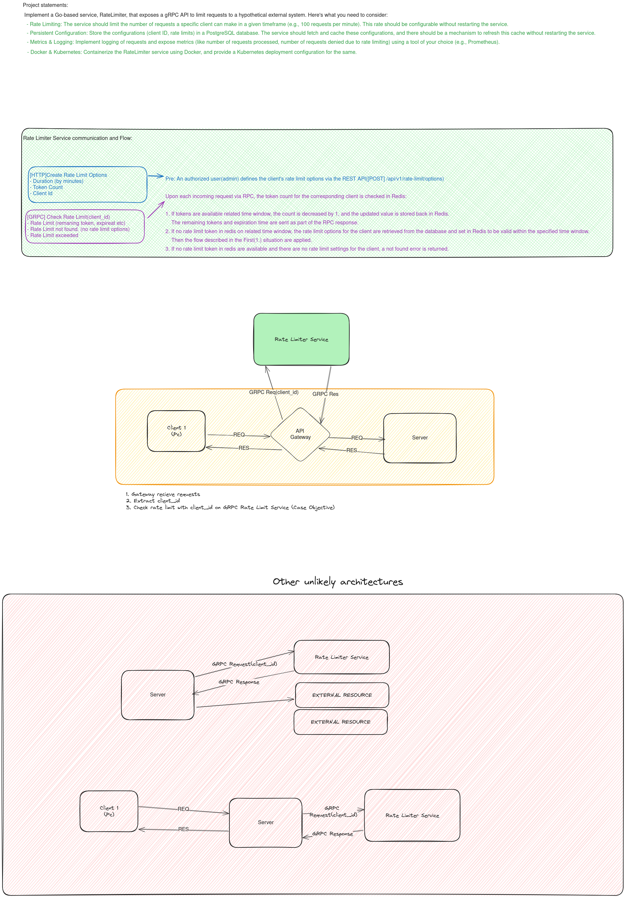

# Go Rate Limiter

This project, implementing rate limit functionality using Golang, PostgreSQL, Redis, Prometheus Docker, Kubernetes, and Chi framework with gRPC and HTTP endpoints.

Also, as a go learner, project architecture was initiated with inspiration from and based on the https://github.com/gmhafiz/go8 project. Thanks to this good starter pack.

I kept the Authentication layer so that I could save some configuration files in the future. But it wasn't necessary here. An extra module.

## Getting Started

Follow these steps to get the project up and running in your local environment.
### TODOs
- [ ] Overall tests
- [ ] Improve logging mechanisms
- [ ] Improve the rate limit duration value type(minutes, hour etc.)
- [ ] Add rate limit unit/functional tests


### Prerequisites

- Golang
- PostgreSQL
- Redis
- (Optional) Docker
- (Optional) Kubernetes/Minikube

### Installation


1. Navigate to the project directory:

   ```bash
    git clone https://github.com/isikhi/go-rate-limiter.git
    cd ./go-rate-limiter
    ```

2. Configuration(Environment)
   ```bash
    cp ./.env.example .env
    ```

3. Install dependencies:

    ```bash
   go mod download
    ```

4. Run Migrations and Seed DB

    ```bash
    go run cmd/migrate/main.go
    go run cmd/seed/main.go
   ```

5. Run App

    ```bash
    go run cmd/app/main.go
   ```

### Install & Run with docker(compose)
1. Clone the repository:

    ```bash
    git clone https://github.com/isikhi/go-rate-limiter.git
    cd ./go-rate-limiter
    ```
2. Configuration(Environment)
   ```bash
    cp ./.env.example .env
    ```

3. Docker Compose up!

    ```bash
    docker compose -f docker-compose.yml up --build
    ```


### Install & Run with kubernetes(minikube)
1. Push to repository to docker hub or use mine.
   - App: `isikhi/go-rate-limiter:app-0.0.1`
   - Migrator: `isikhi/go-rate-limiter:migrate-0.0.1`
   - Seeder: `isikhi/go-rate-limiter:seed-0.0.1`
   
   If you want to build your image follow this steps
   ```bash
   docker build -t your_username/your_repository:app-0.0.1 --build-arg MAIN_GO_FILE_PATH=./cmd/app/main.go .
   docker push your_username/your_repository:app-0.0.1

   docker build -t your_username/your_repository:migrator-0.0.1 --build-arg MAIN_GO_FILE_PATH=./cmd/seed/main.go .
   docker push your_username/your_repository:migrator-0.0.1

   docker build -t your_username/your_repository:seeder-0.0.1 --build-arg MAIN_GO_FILE_PATH=./cmd/migrate/main.go .
   docker push your_username/your_repository:seeder-0.0.1
   ```

2. Run:
   This script will reload everything with kubectl. [kubectl alias](https://minikube.sigs.k8s.io/docs/start/) should have been set
   
   ```bash
   /bin/bash /home/username/path/go-rate-limiter/k8s/deploy.sh
   ```
   PS: In database deployments, I added an additional sleep time of approximately 20-30 seconds to wait until the containers stand up, so that there will be no problems until the containers that do not have health checks stand up.   


# How it works ? Test and Example Usage
If you deploy to the minikube `minikube service list` take url's and use as base domain on below instructions

1. Define Rate Limit Options
   Define rate limit options by referring to the example in [Rate Limit Example Http](./examples/rate-limit.http). You can find an HTTP request example that creates a client, token, and duration (in minutes).

2. Define Rate Limit Options
   Use the RPC client found in [Rate Limit Example RPC Client](./client/main.go) to make a request and determine whether rate limiting is applied or not.

3. Monitor Prometheus Metrics
   Retrieve Prometheus metrics from the endpoint `http://{{BASE_URL}}/metric`.


### Project Statement and Basic Architectural drawings


